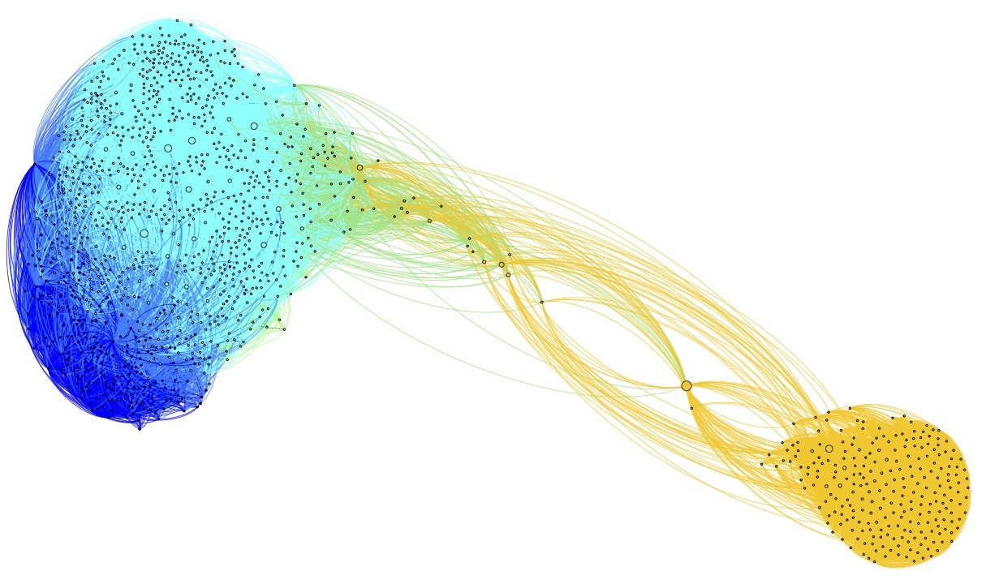
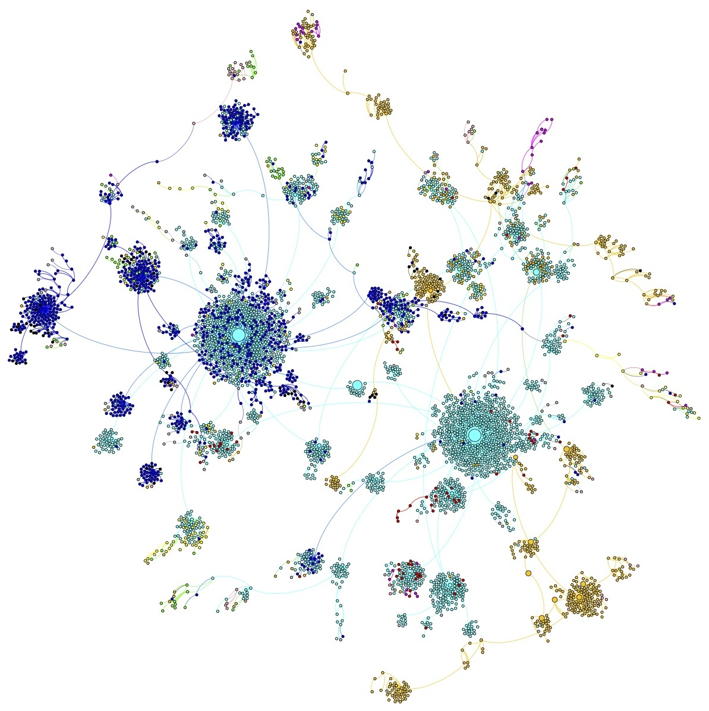
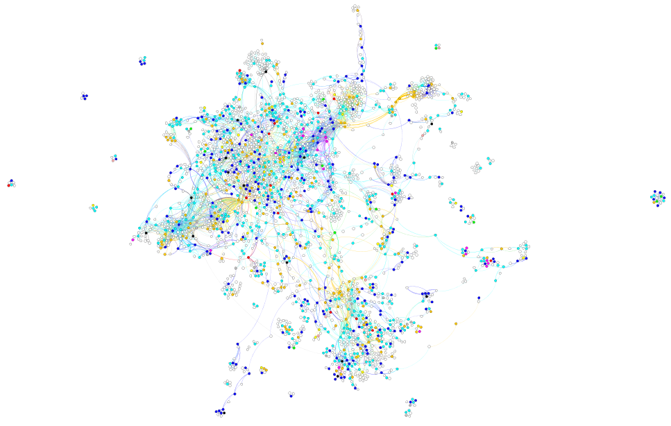

Draft Report
========================================================
Jennifer Chang

**Motivation:**

Organisms are robust systems that will try to compensate for different types of environmental stress effects, adjusting the expression of genes and their protein products accordingly.  This project seeks to gain insight into what pathways are affected by each type of stress. The related pathways may give some idea on how the organism adapts to the environment.

The model organism we're looking at is E coli.  The expression levels of 4495 genes were recorded under different stressful conditions. 

**Questions of Interest:**
* Which genes have similar expression profiles among the different treatments?
* Are genes with similar expression profiles located near each other in biological pathways?

**Data Available:**
* Expression data for 4454 genes in E. coli (microarray experiment) under different stressful conditions.
  * From another student in my lab
* KEGG pathways data from kegg.jp

Libraries
```{r}
#packages<-c("ggplot2","GGally")
#install.packages(packages)
library(ggplot2)
library(GGally)
```

E Coli Data
------------------

```{r}
data<-read.csv("data/gene_median.csv",header=TRUE,stringsAsFactors=FALSE)
data<-subset(data,SD1>=0) # dropped anything that had -1 across all values
data<-subset(data,select=c(Name,C.2:PH1,SD1:UV2)) # Drop C1 and PH2, (bubble on the array)
names(data)<-c("Name","Minimal C-source 2","Minimal C & N Source 1","Minimal C & N Source 2","Cold Shock rep 1","Cold Shock rep 2","Heat Shock rep 1","Heat Shock rep 2","Minimal N Source 1","Minimal N Source 2","Osmotic Shock 1","Osmotic Shock 2","Oxidative Stress 1","Oxidative Stress 2","Low pH 1","Control 1","Control 2","UV Treatment 1","UV Treatment 2")
dim(data)
head(data)
```
The data is E. coli microarry data recording the expression of genes (4472 genes in total) in each row under different stress conditions. (minimal C, N, Cold shock, etc)

The Following produces a parallel cordinate plot of gene expression across all treatments. Each line is a separate gene. 
```{r}
ggparcoord(data, columns=c(2:19))+geom_line()+labs(title="Expression Across All Treatments", x="Treatments", y="Expression")+theme(axis.text.x=element_text(angle=300,hjust=0))
```

Create Clusters: WGCNA Analysis
------------------

Install WGCNA package (The following R code will not execute when knit because eval=FALSE)
```{r,eval=FALSE}
install.packages(c("dynamicTreeCut","cluster","flashClust","Hmisc","reshape","foreach","doParallel"))
source("http://bioconductor.org/biocLite.R")
biocLite("impute")
install.packages("WGCNA")
```

Analyze the microarray data and cluster the genes into Modules
```{r}
library(WGCNA)
allowWGCNAThreads()

# Prepare data for input
input<-as.data.frame(t(data[,-1]))
names(input)=data$Name
head(input[,1:6])

# Choose soft threshold
powers=c(c(1:10),seq(from=12,to=30,by=2))
sft=pickSoftThreshold(input,powerVector=powers,verbose=5)

sizeGrWindow(9,5)
par(mfrow=c(1,2))
cex1=0.9
plot(sft$fitIndices[,1],-sign(sft$fitIndices[,3])*sft$fitIndices[,2], xlab="Soft Threshold (power)", ylab="Scale Free Topology Model Fit, signed R^2", main=paste("Scale independence"))
text(sft$fitIndices[,1],-sign(sft$fitIndices[,3])*sft$fitIndices[,2], labels=powers,cex=cex1,col="red")
abline(h=0.90,col="red")
plot(sft$fitIndices[,1],sft$fitIndices[,5],xlab="Soft Threshold (power)", ylab="Mean Connectivity", type="n", main=paste("Mean connectivity"))
text(sft$fitIndices[,1],sft$fitIndices[,5],labels=powers,cex=cex1,col="red")
```

For some reason plot does not produce an image in knitr.
I've included a screen shot of the image here. 
<embed type="image/svg+xml" src="img/softthreshold.svg" />

I chose a soft threshold of 7

```{r,fig.width=12,fig.height=9}
# Cluster into Modules
net=blockwiseModules(input,power=7,minModuleSize=30,reassignThreshold=0,mergeCutHeight=0.25,numericLabels=TRUE,pamRespectsDendro=FALSE,saveTOMs=TRUE,saveTOMFileBase="geneTOM",verbose=3)

# create dendrogram
sizeGrWindow(12,9)
mergedColors=labels2colors(net$colors)
plotDendroAndColors(net$dendrograms[[1]],mergedColors[net$blockGenes[[1]]],"Module colors",dendroLabels=FALSE,hang=0.03,addGuide=TRUE,guideHang=0.05)
data$cluster=mergedColors
table(data$cluster)
```
Each module is given a color name.  The table above shows the number of genes clustered into each module. The cluster 0 contain genes actually contains genes that did not fit in any other cluster. So really there are 9 clusters and 125 unclustered genes

Viewing the transcription levels in each cluster
```{r}
# can't get facets to work with ggparcoord, must go back to ggplot
ggparcoord(data, columns=c(2:19),groupColumn=20)+geom_line()+labs(title="Clustered Genes", x="Treatments", y="Expression")+theme(axis.text.x=element_text(angle=300,hjust=0))

library(reshape)
data.m<-melt.data.frame(data, id.vars=c("Name","cluster"))

ggplot(data.m, aes(x=variable,y=value,colour=cluster,group=Name))+geom_line()+facet_wrap(~cluster)+theme(axis.text.x=element_text(angle=300,hjust=0))+labs(title="Expression by Clustered Genes", x="Treatments", y="Expression")
```

Export Co-expression Matrix as a graph

```{r}
# Creates the adjacency matrix for the genes
adjacency = adjacency(input, power = 7)
TOM = TOMsimilarity(adjacency) # takes some time
dimnames(TOM) = list(data$Name,data$Name)
head(TOM[1:6,1:6])
```

The following creates 2 files. A node file and an edge file. This can be read into an outside graph drawing software.  I used gephi. (This will not evaluate during knitr, eval=FALSE)
```{r, eval=FALSE}
module=c(unique(mergedColors))
genes=names(input)
cyt = exportNetworkToCytoscape(TOM,
edgeFile = paste("CytoscapeInput-edges-", paste(module, collapse="-"), ".txt", sep=""),
nodeFile = paste("CytoscapeInput-nodes-", paste(module, collapse="-"), ".txt", sep=""),
weighted = TRUE,
threshold = 0.02,
nodeNames = genes,
nodeAttr = mergedColors);
```

There were around 4 Million interactions.  I sorted the interactions by weight (co-expression value between two genes) and then arbitrarily visualized the top 50,001 interactions in gephi. Image created here.  Nodes are colored by cluster. Size of node by number of degrees (connecting edges).  As can be seen 3 clusters stand out. (yellow, turquoise, and blue) There is actually a 4th cluster.  3 genes from the red cluster are sitting inside the turqoise cluster.  I left off the labels because then it would be a mess of text. Even so I'm not sure if this graphic is very useful.



Then I found the spanning graph of the interactions.  (Least number of edges to include all nodes in the graph.  Keep the highest weighted edge.)  I'm still working on comparing the spanning graph with the biological pathways graph in KEGG.



Incorporating KEGG Biological Pathway Data
-------------------------
Each gene (eg. thrA) is associated with a particular KEGG gene id (eco:b0002).  In order to find the KEGG id, you can use the following website:

* http://www.kegg.jp/dbget-bin/www_bfind_sub?max_hit=1000&dbkey=eco&mode=bfind&keywords=thrA
    
Replace the keywords=thrA with whichever gene you are searching for.  I focused on E coli pathways (dbkey=eco) because that is the organism where our expression data comes from.  I used a perl script to get the KEGG id, gene description and pathway ids.  356 genes did not have a corresponding KEGG id.

This gives you a html page of results.  I can parse the html to get the KEGG gene id and the gene description.

```{r}
kegg.genes<-read.table(file="data/id_gene_des.txt",header=TRUE,quote = "",sep=" ",stringsAsFactors=FALSE)
kegg.genes$gene_description<-gsub("_"," ",kegg.genes$gene_description)
kegg.genes$gene_description<-gsub(";"," ",kegg.genes$gene_description)
kegg.genes$gene_description<-gsub(","," ",kegg.genes$gene_description)
kegg.genes$short_description <-substr(kegg.genes$gene_description,1,50)
head(kegg.genes[,c(1,2,4)])
```

```{r}
library(XML)
url <- "http://www.kegg.jp/dbget-bin/www_bfind_sub?max_hit=1000&dbkey=eco&mode=bfind&keywords=thrA"
doc<-htmlParse(url)
body<-xmlChildren(root)[[2]]

# I'm going to try to find a way to do this in R instead of perl scripting and include the code here. Regardless getting information for over 4000 genes takes a few hours.  Must put in 1 second delays between each html page reteival or can be cut off as a denial-of-service attack.
```

The pathways data can be collected from the following website:

* http://www.kegg.jp/dbget-bin/www_bget?eco:b0002

Where "eco:b0002" can be replaced by whichever KEGG gene id you're looking at.  Then pull out the Pathways entry in the table. The Pathways entry contains the KEGG pathway id and the Pathway name.

```{r}
kegg.paths<-read.table(file="data/eco_path_des.txt",header=TRUE,quote = "",sep=" ",stringsAsFactors=FALSE)
kegg.paths$pathway_description<-gsub("_"," ",kegg.paths$pathway_description)
head(kegg.paths)
```

I combined each kegg pathway file into one graph. The pathways graph is different from the WGCNA generated graph because it includes compounds. (e.g. glucose, ATP, water, etc). An example of a biological pathway is Glycolysis. It would have a node for glucose (compound) which would connect to hexakinase (enzyme) which would connect to glucose-6-phosphate (compound) which would connect to phosphoglucose isomerase (enzyme) etc.  Compounds and E coli genes not in the original microarray data are colored white.  All the other nodes are colored by cluster. I filtered out any nodes with no edges. (Sometimes KEGG merely groups some genes together as components of an enzyme but then doesn't connect it with any other enzymes/compounds.  I'm trying to figure out why. Still exploring the data.) I was hoping that genes in the same cluster would be near each other in the pathway but that wasn't the case. 



Part of the problem is the fact that many of the genes in the microarray data was not represented in the pathways data. (336 genes had no KEGG id. 2604 genes with KEGG ids had no KEGG pathways data. There were 4454 genes total. Therefore at max, there could be 1514 genes in the KEGG pathways graph.)

Maybe Go in a Different Direction...
-----------------------
While I'm still working with the KEGG pathway graph, I may explore a different direction.  Maybe do a Gene Ontology Enrichment (WGCNA contains a function) in the modules then create a shiny app where you can select each module and it will display a word cloud of GO terms for the selected module. I don't think there's a fast or convienent way to display very large graphs in R. I may be wrong but I haven't run into anything that can deal with my dataset yet. 

Example word cloud below.

```{r}
# text mining example
library(tm)
library(wordcloud)

# prepare the data
m1 <- merge(data, kegg.genes, by.x = "Name", by.y = "gene")
g_c_d<-m1[,c(1,20,22)]
write.csv(g_c_d,file="data/gen_cluster_des.txt", row.names=FALSE)

current_mod<-subset(g_c_d, cluster=="green")

wc.input<-paste(current_mod$gene_description,collapse="")
#head(wc.input)
path_words<-Corpus(VectorSource(wc.input))
path_words <- tm_map(path_words,stripWhitespace)
path_words <- tm_map(path_words,tolower)
path_words <- tm_map(path_words,removeWords,stopwords("english"))
#path_words <- tm_map(path_words,stemDocument)
 #inspect(path_words) 
# word cloud example

par(mar=rep(2,4))
wordcloud(path_words,scale=c(5,0.5),max.words=100,random.order=FALSE,rot.per=0.35,use.r.layout=FALSE,colors=brewer.pal(8,"Dark2"))

#wordcloud(c(letters, LETTERS, 0:9), seq(1, 1000, len = 62))
```

Shiny App (not running right now, eval=false)
```{r,eval=FALSE}
# Shiny app
library(shiny)
runApp("my_app") # this is not done yet.  Right now it only has the tutorial files
```